## 出發前的刻板映像

 
峇里島，隸屬於印尼的美麗島嶼，與台灣同一個時區。在這之前為了感受印尼的氛圍我還特別在 Netflix 上觀看了當地的 TV series 「惡夢美夢」，試圖感受一下當地風氣，在我的 **視覺** 以及 **想像** 下草率的下了定論：

### 當地一定超熱

事實並不然，九月屬於峇里島的乾季，同時也是旅遊淡季，半夜或大清早可能下著雨，但剩下大多都處於多雲的情況，因此可以避免太陽直接照射，加上濕度低，基本上 **爆汗人** 如我，也難得可以找到一個屬於自己的天堂，五天都保持乾燥舒適，無論是中午至下午，只要沒有大太陽持續的照射都可以感受到涼風吹拂。

### 當地飲食辛辣

出乎意料，峇里島的飲食就同我們抵達時所感受到的人與氣候一樣，誠如 Podcast「這又沒有很屌」，一集討論雷擎新專輯「東南亞探險隊」的描述。

峇里島的食物相較於泰國，調味溫和且恰到好處，看起來超辣的佐料以及調味，標榜中辣的食物卻都只是小酸小辣，很適合初次想挑戰東南亞食物的台灣人嚐鮮。

## 醜話說在前面，後面剩好話

對於峇里島（Bali），我大致上只有兩個點可以抱怨：

### 不太理想的交通環境

我們住的 Villa 在庫塔的北邊，有點靠近長谷（Cangu）以及水明樣（Seminyak）海邊，搭車過去非尖峰時段搭配上 Gojek 這個叫車應用的新戶優惠只需要 36000 RP（約72 台幣），你可別看車程只有十七分鐘，這一趟實際上可能會要你一個小時以上！峇里島的道路大致上都只有台灣的住宅區巷子那麼寬，且沒有直通的大路可走。

在東南亞如果想要搭到最便宜的計程車，大多都要攔車並砍價，但很多時候你只想好好享受旅程不想多說廢話，這時候可以使用 Gojek 叫車，價格也很實惠。

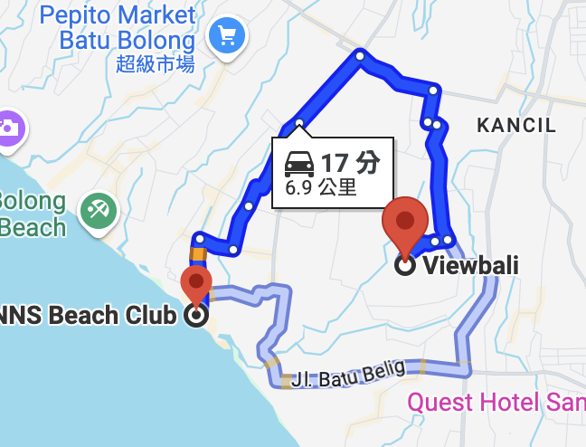

計程車陷阱：當你叫車可能會遇上兩種陷阱

1. 略過直接透過平台通話給你說你要不要給我某個金額我才載你，這種直接取消訂單
2. 第二種推薦你包車行程的，有時候我們不會有太多點要走，通常可以在一個地方耗上幾小時，這時候單純透過線上平台叫車即可會省下很多錢
### 水質問題

最後一天回程以前我們因為「髒水症」發燒頭痛想吐，事實上我女友真的吐了，我回程前到超商買了退燒藥才稍微好一點。有了泰國的經驗，為了防止頭髮被礦物質所傷，我們帶了可過濾的蓮蓬頭，但卻防止不了當地的冰沙、冰塊飲料相關（忍不住），水質是一個大問題。

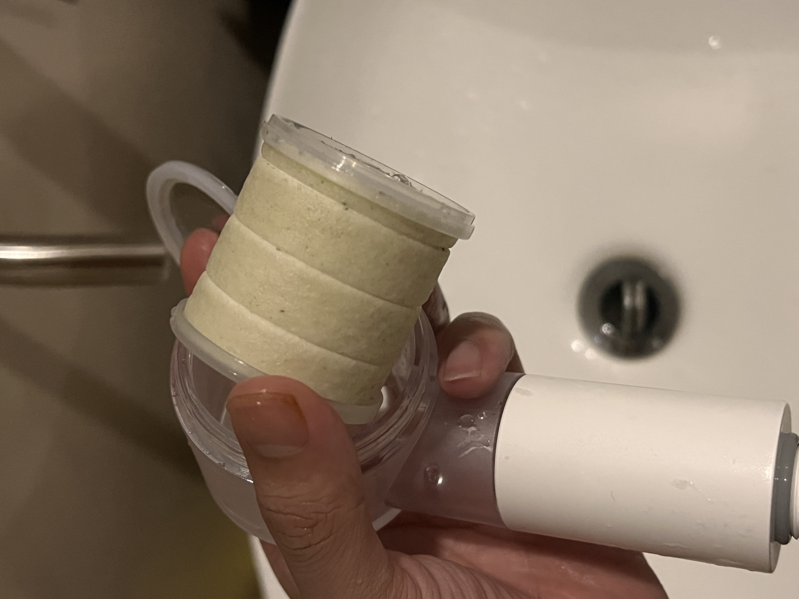

## 旅程

在旅行前我們看過了許多的 「小紅書」貼文，基本上我不會參考太多情緒上的東西，因為我覺得這上面的言論通常不是大恨就是大愛，很多博眼球的東西，只為了吸引眼球和同溫層。

基於事情都是基於當事者的角度給予價值，我只有在安排行程時會看一下小紅書，不得不說還是比很多平台容易得到資訊，包含台北當地的咖啡廳景點都很好用，其他平台要加油了（或是我不太會用，不要揍我）。

### Villa

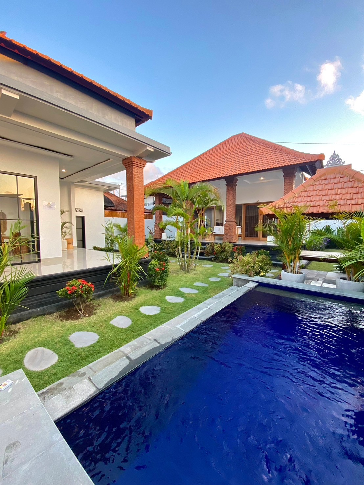

下飛機後，我們立馬前往位於庫塔區（Kuta）的 villa 進行 check in，整體感受上很舒適，感覺適合安排一趟更長的旅程好好享受在這裡的悠閒時光。

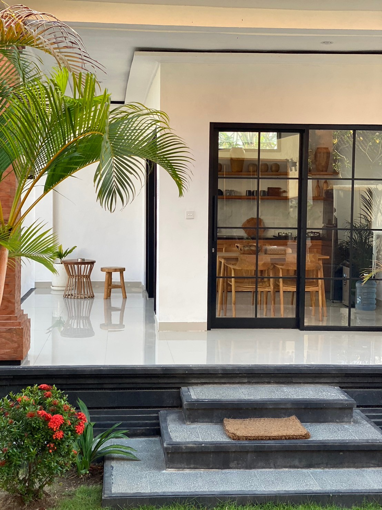

坦白說來峇里島吃飯應該不算太大的重點，如果可以，買些食材自己料理應該也不錯，當地人的平均薪資大約落在 1 萬 5 台幣，應該可以省下不少。除了給觀光客吃的食物之外我們也常叫當地的外送，肯德基、麥當勞這類的在品項加價購了以後含外送費每人不到 $100 台幣。

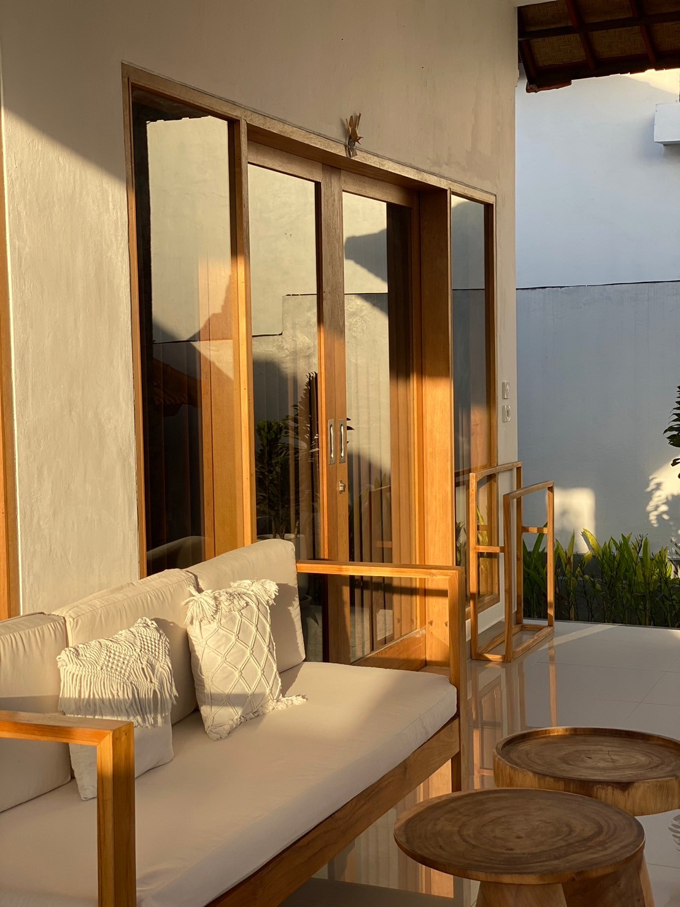

而我們經常在這邊享受夕陽灑落的感覺亦或是晚風吹拂，總之在我們拜訪的這幾天怎樣都很舒服。

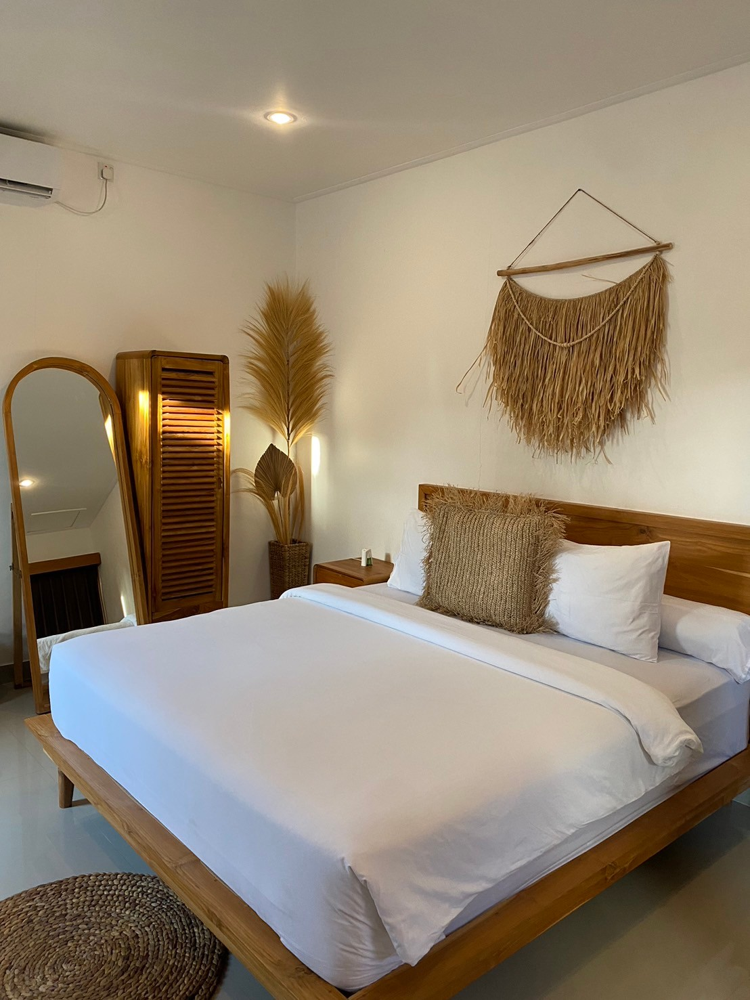

這張長可能是我近期睡過最舒服的床，在這邊即便是為了趕行程而只睡了四小時，深眠時常能夠達到 20% ~ 30%，一躺下就睡死了！

### 庫塔海灘（Kuta beach）

因為女友很享受花錢買伴手禮給朋友的感覺，因此我們離開 villa 後第一站就前往庫塔海攤，那裡有小紅書推薦的禮品店可以讓你先把紀念品搞定後專心你的旅程！

但在這裡最讓我開心的是在這邊體驗 baliness massage，一個小時只要 $230 左右的台幣，店內都是不可以滑手機聊天的，提供客人安靜的休息空間，開始前會詢問你要 「hard or soft」，而我這次希望可以好好的睡一覺因此選擇了輕柔的版本，同時我也第一次被按摩按到睡著～

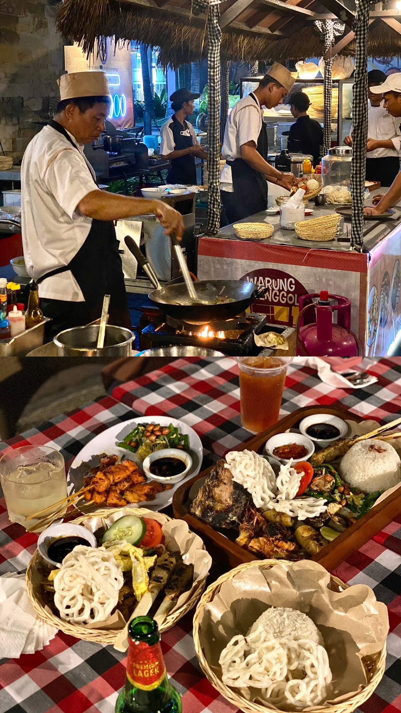

附近的露天餐廳就有好吃的沙爹烤串，服務人員到點會邀請大家起來跳舞。

### 烏布區（Ubud）

#### 瀑布

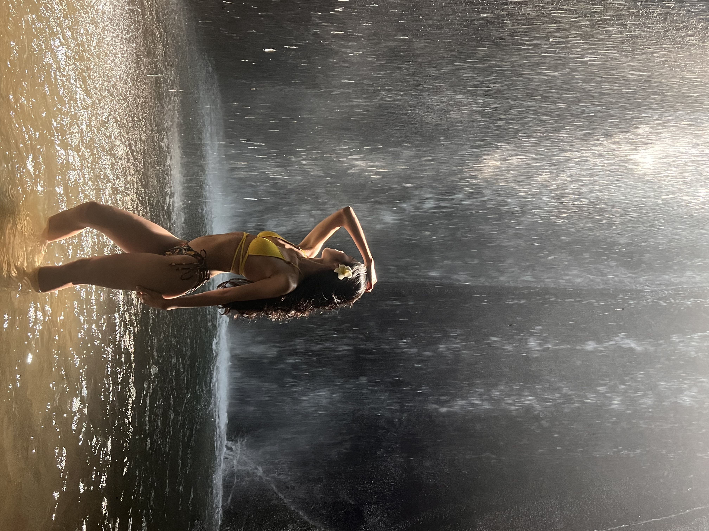

第二天一早我們包車前往了烏布區的瀑布，幫女友拍了漂亮的照片，我太胖就不好意思秀出來，而烏布區有許多不同的瀑布可以選擇！

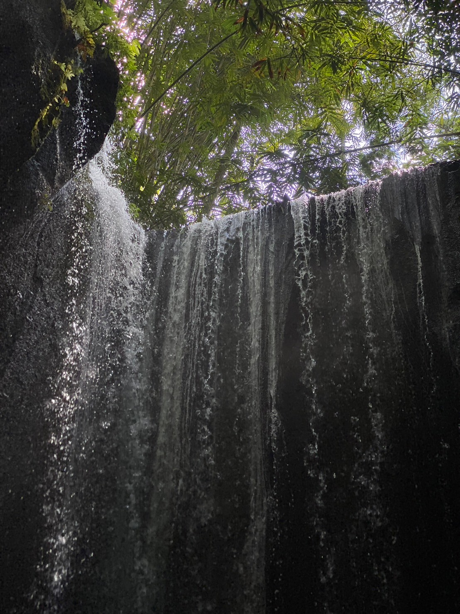

位於山中的瀑布相當涼爽，我們大概在中午前抵達這裡，拍完照後人漸漸變多，一定要提早來！

#### 猴子公園附近的烤肋排

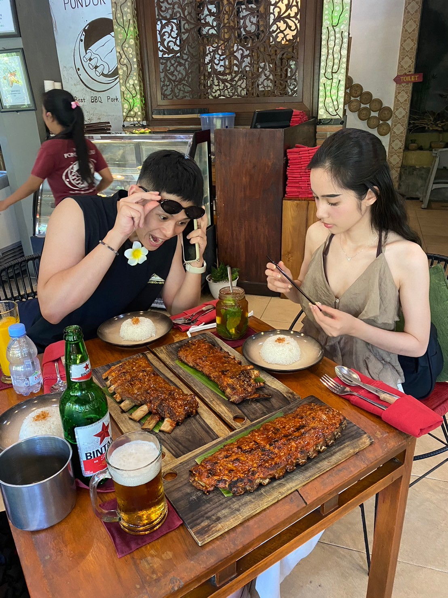

酸甜的烤肉醬，一人只要 ＄450 台幣左右就可以享有一份大份的烤肋排，但烤肋排在峇里島算很常見的食物，基本上都表現不差！

### 長谷區（Cangu）
#### 市集

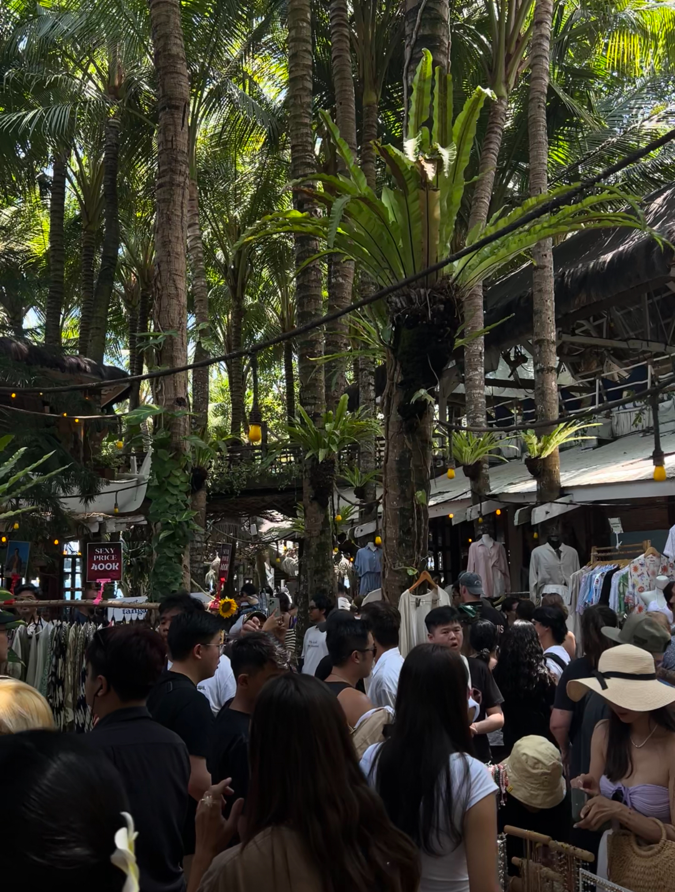

你常常看到人家說的 Sunday market，其實是在長谷區海邊的 La Brisa Market，**千萬不要跟司機說要去 Ubud market**，他會以為你說 monkey，因為那邊只有猴子公園，為什麼我知道？因為我們真的遇上英文不好的司機跑去了猴子公園看了兩隻猴子。

如果你想去網紅 Molly 去的就在長谷 La Brisa Market 沒錯！
\
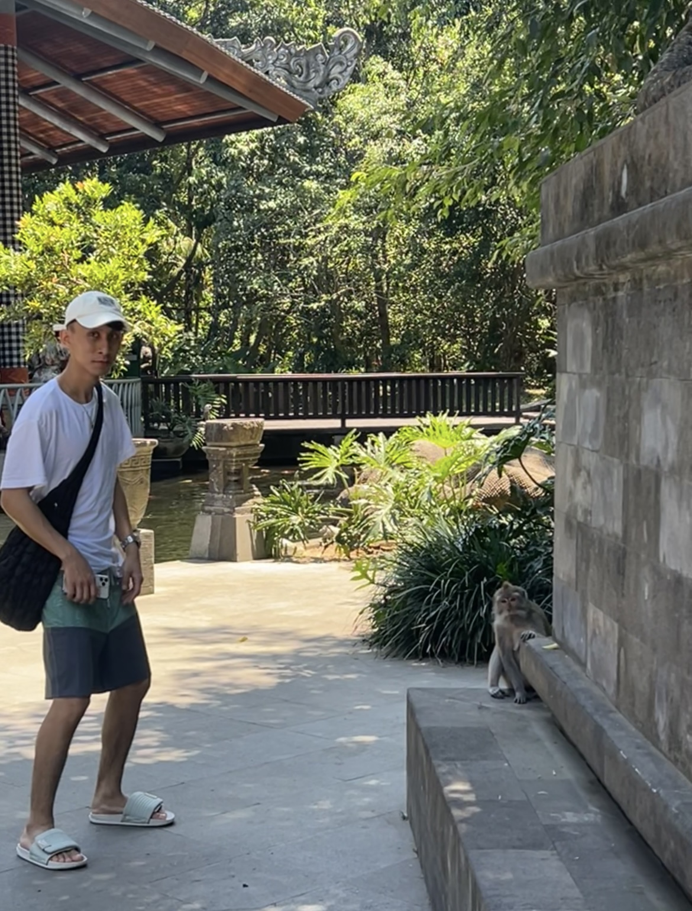

#### 網美咖啡廳 Gigisusu

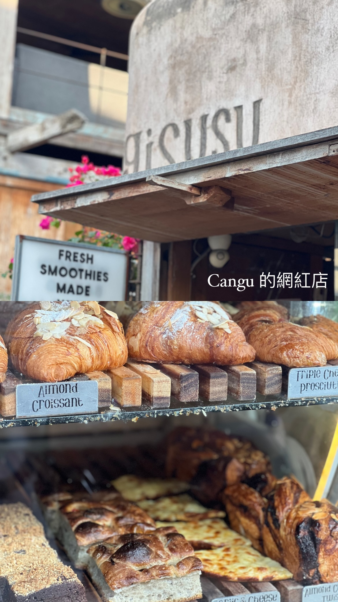

大排長龍的網紅咖啡外帶店，外面充滿拍照人潮，不只販售咖啡還有果昔以及茶類，berry boost 以及 oolong tea 不符合我們的胃口。

#### Finns beach club

價格實惠，餐點好吃而且峇里島的 beach club 都會有 happy hour，因此搭配酒精飲料不會太貴整餐吃下來一人差不多 $1005 台幣，而且餐點是來峇里島吃過最有品質的，我的廚師朋友認證！餐廳內也有很多帶氣氛的員工，還有熱情的澳洲人對我催婚，叫我趕快把女友娶回家！

整體就是狂歡的場所，女性會介意務必保護好自己，隨時有可能會有不安分的小手摸上來。

### 藍夢島（Lembongan）

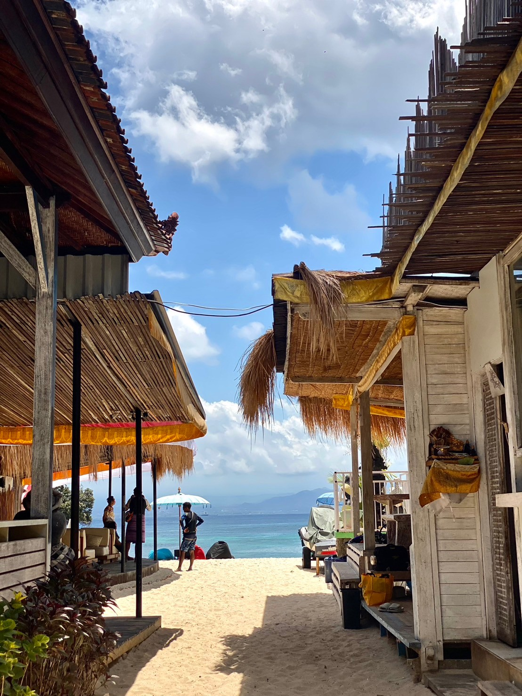

我們來這邊是為了搭快艇出海浮潛，但因為浪太大了我們潛伴們都紛紛投降，不過慶幸是一下水就看到魟魚！

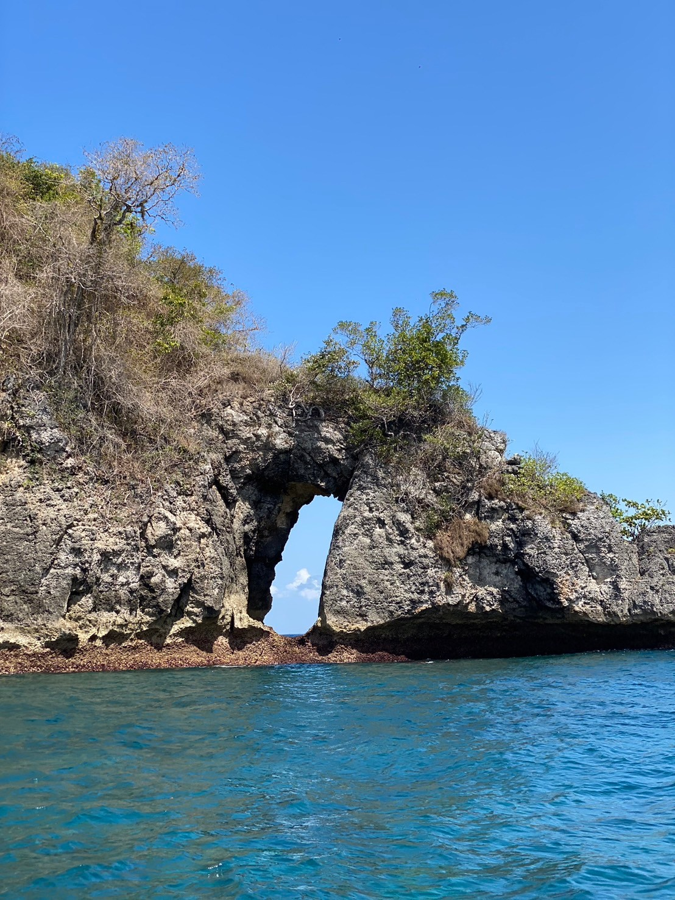

這邊的海景真的太無敵了，水質清澈透過麵包就可以讓小魚們圍繞著你！

### 金巴蘭（Jimbaran）

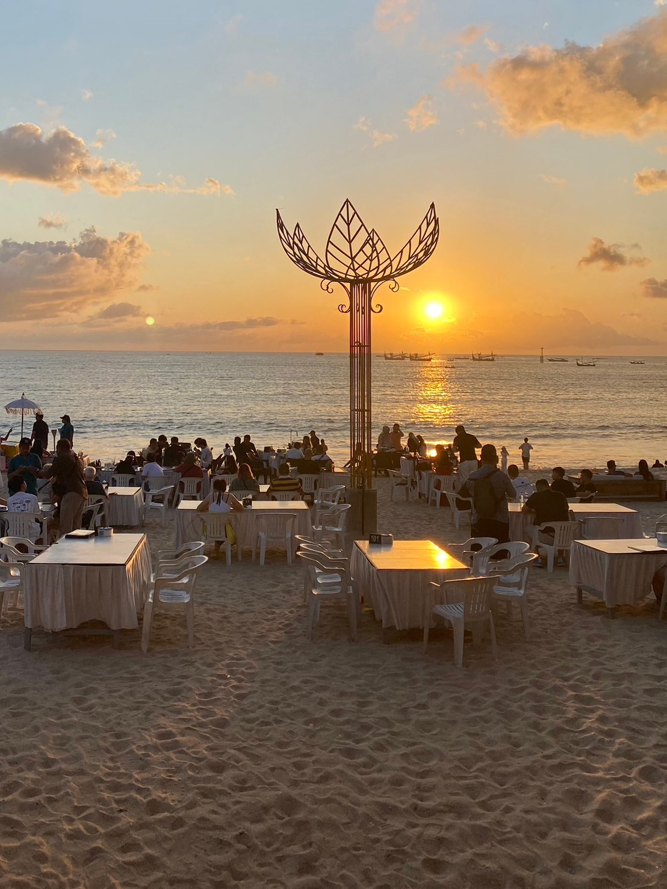

會來這邊是因為包車司機拐我們過來，這裡以前是小漁村後來變成觀光景點，在峇里島的南方，通常都是跟團的旅客或是司機帶來的，而食物的部分個人覺得沒有非得到這裡來吃，或許有更多行程可以考慮。

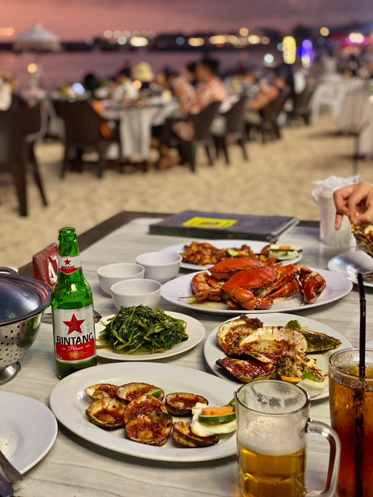

但這裡的烤玉米很讚也很便宜大概 $45 台幣一支！

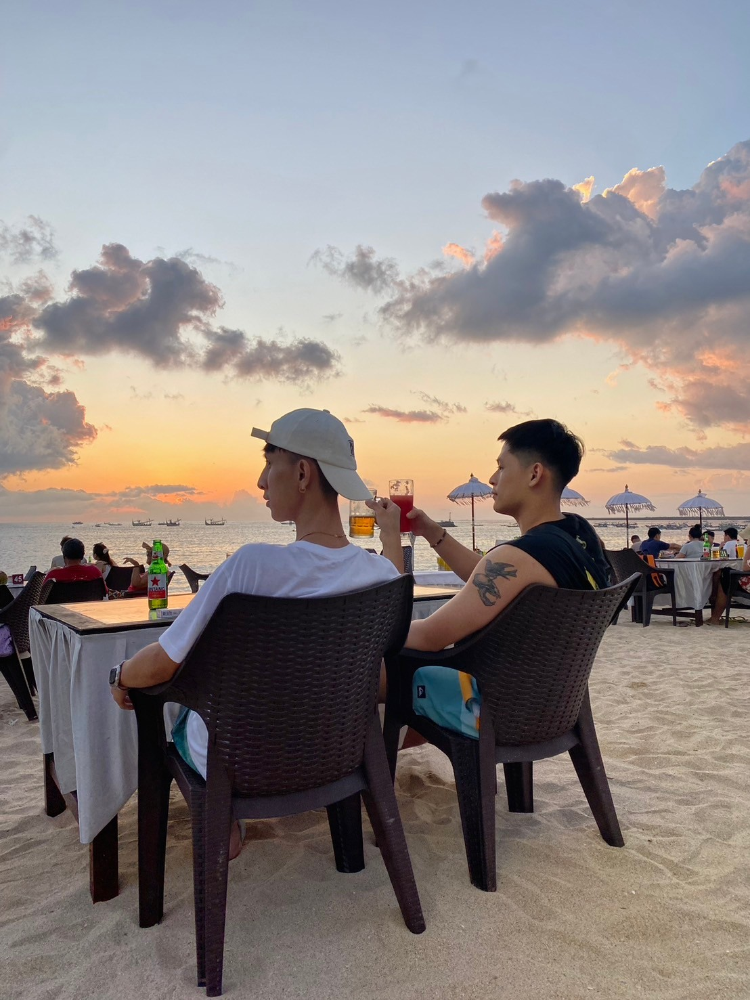

### 水明漾（Seminyak）

來這個地方是本地友人亞妮以及她的男朋友帶我們來追逐夕陽，拍了一系列漂亮的照片，亞妮有一位攝影師男友 @ghading_photography，大家來峇里島玩可以來找他攝影，難得旅遊經驗絕對不後悔～

## 總結

峇里島的氣候出乎意料的舒服，這次安排五天四夜個人認爲對於這邊的種種來說都太過短暫，也許下次會選擇住在比較市中心的酒店，並且放慢腳步慢慢去體會這裡的悠閒步調，畢竟為了在五天內能夠去到幾個規劃好的地方，代價就是要花比較多的通勤時間，如果要深度旅遊，去峇里島的北方看看海豚也是不錯的選擇！

峇里島是繼泰國後我第二個旅遊的地點，同時也因為這邊的物價、氣候表現，讓我有了旅居峇里島的想法，這裡相較曼谷、台北，沒有那麼悶熱潮濕，讓人心情上很放鬆，外加上瑜伽、健身風氣符合我與女友的生活習慣，來峇里島旅遊或是居住我是很推薦的。

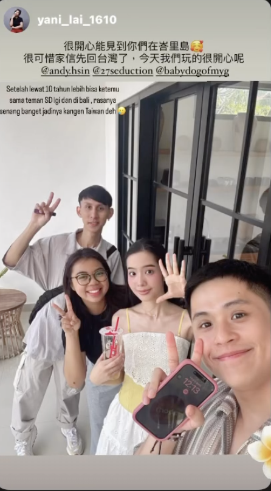

此外旅行也讓我們結交了意想不到的朋友，能夠更了解當地的生活以及不同地方生活有什麼不同的想法，回國之後勢必好好的累積自身能力好重新出發。
